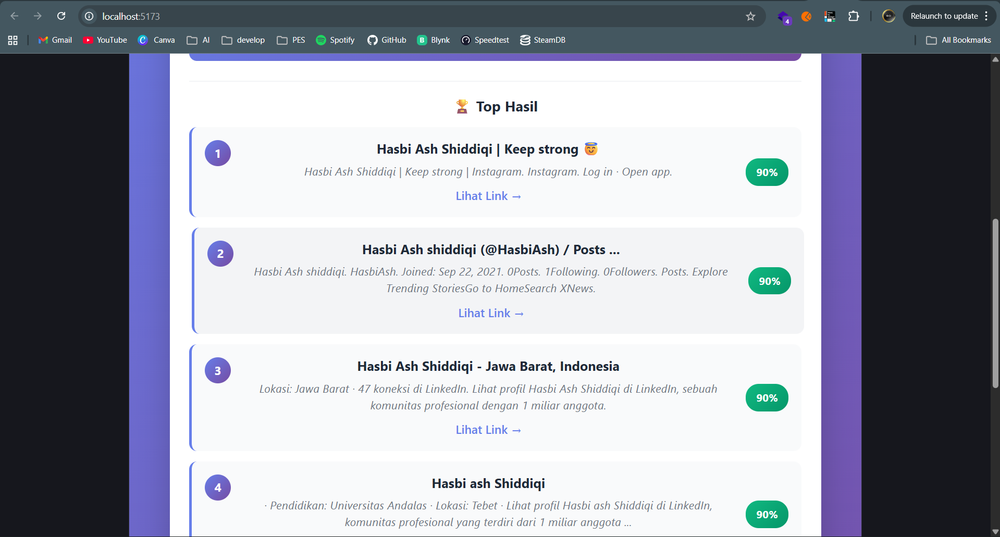
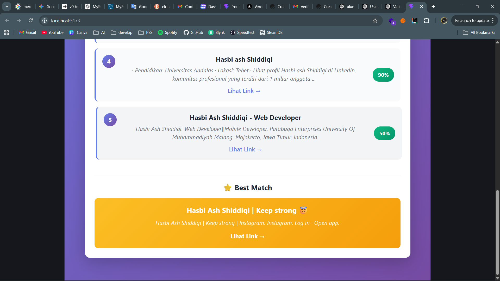

# 🎓 Alumni Tracker System

Sistem pelacakan status alumni berbasis web yang dirancang untuk membantu institusi pendidikan mengidentifikasi aktivitas profesional atau akademik alumni melalui berbagai sumber publik di internet.

Proyek ini merupakan implementasi dari desain sistem pada **Daily Project 2 – Rekayasa Kebutuhan**.

---

# 👤 Identitas Mahasiswa

Nama : Hasbi Ash Shiddiqi  
NIM : 202210370311391  
Kelas : Rekayasa Kebutuhan B  

---

# 🌐 Demo Aplikasi

Frontend (Web)  
https://tracker-alumni.up.railway.app  

Backend API  
https://alumni-tracker-beprod.up.railway.app  

Repository Github  
https://github.com/hsdiqi/alumni-tracker

---

# 📦 Struktur Project
```
alumni-tracker
│
├── fe/ # Frontend Vue.js
│
├── be/ # Backend FastAPI
│
├── assets/ # Hasil percobaan / dokumentasi testing
│
├── README.md
│
└── dockerfile / deployment config
```


---

# 🧠 Konsep Sistem

Sistem ini bekerja dengan melakukan pencarian terhadap data alumni pada berbagai sumber publik, kemudian melakukan **disambiguasi dan scoring** untuk menentukan kemungkinan kecocokan identitas alumni.

Tahapan sistem:

1. **Inisialisasi Profil Alumni**
2. **Penjadwalan Tracking**
3. **Pengambilan Data dari Multi Source**
4. **Scoring dan Confidence Calculation**
5. **Verifikasi Manual jika diperlukan**

Contoh sumber data:

- Google Scholar
- ORCID
- ResearchGate
- Public Web

Algoritma ini menggunakan **confidence scoring** untuk menentukan apakah kandidat benar merupakan alumni yang dicari. :contentReference[oaicite:1]{index=1}  

---

# 🧱 Teknologi yang Digunakan

Frontend

- Vue.js
- Vite
- CSS

Backend

- FastAPI
- Python
- REST API

Database

- MySQL

Deployment

- Railway (Backend)
- Railway + Docker + Nginx (Frontend)

---


---

# 🔗 API Endpoint

Contoh endpoint utama:

| Endpoint | Method | Deskripsi |
|--------|--------|--------|
| /targets | GET | mengambil daftar alumni |
| /targets | POST | menambahkan alumni |
| /targets/{id} | PUT | update data alumni |
| /targets/{id} | DELETE | hapus alumni |
| /track/{id} | GET | melakukan tracking alumni |
| /evidence/{id} | GET | melihat bukti pelacakan |

---

# 🧪 Pengujian Aplikasi

Pengujian dilakukan berdasarkan aspek kualitas sistem yang telah dirancang pada Daily Project 2.

| No | Aspek Kualitas | Metode Pengujian | Hasil |
|---|---|---|---|
| 1 | Functional | Menguji fitur tambah alumni | Berhasil |
| 2 | Functional | Menguji fitur tracking alumni | Berhasil |
| 3 | Functional | Menguji fitur edit data alumni | Berhasil |
| 4 | Functional | Menguji fitur hapus alumni | Berhasil |
| 5 | Reliability | Sistem tetap berjalan saat banyak request | Stabil |
| 6 | Usability | Interface mudah dipahami | Baik |
| 7 | Performance | Waktu respon API < 2 detik | Baik |
| 8 | Compatibility | Aplikasi berjalan di Chrome dan Edge | Berhasil |

---

# 📷 Hasil Percobaan

Dokumentasi pengujian aplikasi dapat dilihat pada folder:

Berisi screenshot hasil:





---

# 🚀 Fitur Utama

✔ Menambahkan data alumni  
✔ Melakukan tracking otomatis  
✔ Menampilkan confidence score  
✔ Menyimpan evidence hasil pencarian  
✔ Verifikasi manual evidence  
✔ Dashboard monitoring alumni  

---

# 📌 Kesimpulan

Sistem Alumni Tracker berhasil dikembangkan sebagai aplikasi web yang mampu melakukan pelacakan status alumni berdasarkan berbagai sumber publik.

Dengan menggunakan metode **confidence scoring dan evidence verification**, sistem ini dapat membantu institusi pendidikan memonitor perkembangan alumni secara lebih efisien.

---

# 📄 Lisensi

Project ini dibuat untuk keperluan **tugas akademik Rekayasa Kebutuhan**.